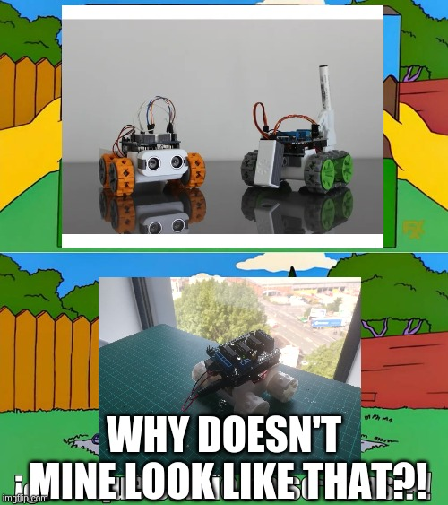

## Robot #1
I've got no engineering experience at all! But I do have a printer and a week off.

The basic chassis is from this open source [SMARS robot](https://www.thingiverse.com/thing:2662828), which fits an Arduino Uno and a motor driver.

